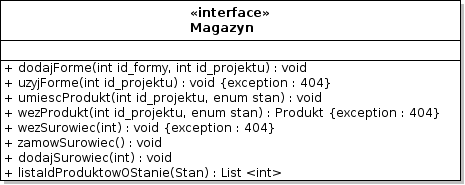
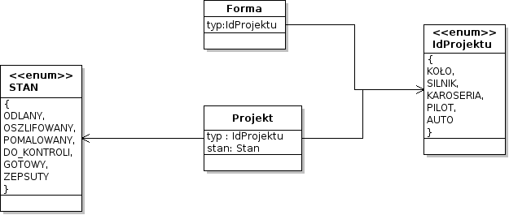
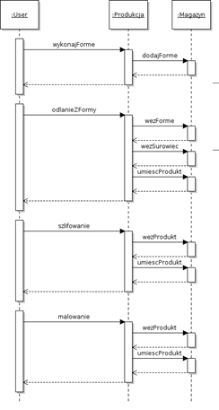
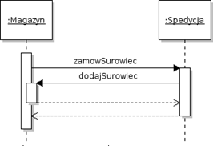
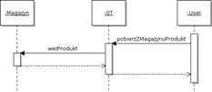
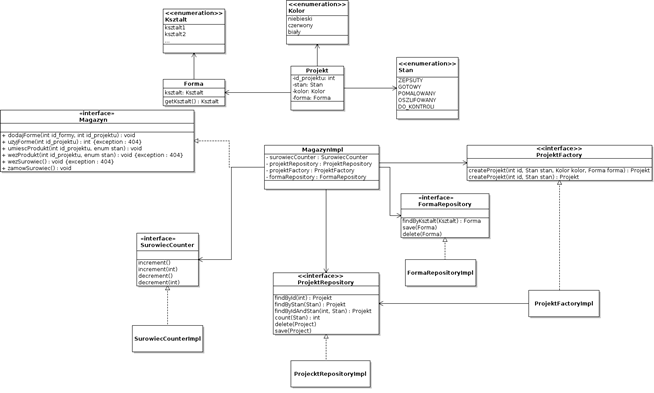

#Magazyn
**Osoby odpowiedzialne:**
* Adrian Molka
* Strahil Mitrev
* Marcin Lewicki

##Operacje dostarczane przez usługę

| Operacja | Wejście | Wyjście | Wyjątek | 
| -------- | :-----: | :-----: | ------: | 
| Dodaj forme | idProjektu:int | void | - |
| Użyj forme | idProjektu:int | void | 404 |
| Umieść produkt | idProjektu:int, idStanu:int | void | - |
| Weź produkt | idProjektu:int, idStanu:int | Produkt | 404 |
| Weź surowiec | ilosc:int | void | - |
| Zamów surowiec | void | void | - |
| Dodaj surowiec | ilosc:int | void  | - |
| Zwróć listę produktów w stanie | idStanu:int | List<id:int> | - |

***Opis***

* **Dodaj forme -** operacja odpowiada za dodanie formy danego typu(idProjektu), na stan magazynu. 
* **Użyj forme -**  operacja odpowiada za użycie formy, danego typu(idProjektu). Każdą formę można użyć 10 razy.
* **Umieść produkt -** operacja dodaje na stan magazynu produkt (idProjektu) w danym stanie (stan).
* **Weź produkt -** operacja wydaje ze stanu magazynu produkt (idProjektu) w danym stanie (stan).
* **Weź surowiec -** operacja wydaje ze stanu magazynu surowiec w zadanej ilości (ile).
* **Zamów surowiec -** operacja wywoływana automatycznie w momencie alarmującej ilości surowca na stanie magazynu. 
    Wywoływana na spedycji. Nie powinna być wywoływania przez innego użytkownika niż magazyn.
* **Zwróć listę produktów w stanie -** operacja zwraca **listę IdProjektu** projektów, na stanie magazynu o zadanym stanie.
	Czyli dla stan = 5 (co odpowiada Stan.ZEPSUTY), zwróci lista = {0, 0, 1, 1, 4} co można tłumaczyć na:
		{IdProjektu.KOLO, IdProjektu.KOLO, IdProjektu.SILNIK, IdProjektu.AUTO}

***MAPOWANIA INT <-> ENUMÓW***

Usługi przyjmują inty które odpowiadają poszczególnym enumów

 _Stan_

| int | enum |
| --- | ---- |
| 0 | ODLANY |
| 1 | OSZLIFOWANY |
| 2 | POMALOWANY |
| 3 | DOKONTROLI |
| 4 | GOTOWY |
| 5 | ZEPSUTY |
| 6 | DORECYKLINGU |

_IdProjektu_

| int | enum | 
| ----| ---- | 
| 0 | KOŁO |
| 1 | SILNIK |
| 2 | KAROSERIA |
| 3 | PILOT | 
| 4 | AUTO |

***Diagram interfejsu***

**Wizja struktury klasy Projekt**

##Diagramy sekwencji:

Poniżej przedstawione zostały diagramy sekwencji, które opisują
interakcję pomiędzy usługą magazynu, a pozostałymi usługami. User to
dowolna usługa wywołująca metodę innej usługi.

 

##Szczegóły implementacyjne 

**Diagramy klas:**

Powyższy diagram prezentuje propozycję naszego zespołu dotyczącą modelu
klas. Wszystkie przypadki użycia są zdefiniowane w metodach interfejsu
**Magazyn**. Wszystkie dodane formy lądują w bazie danych za
pośrednictwem klasy implementującej **FormaRepository**, natomiast każdy
umieszczony projekt trafia do bazy danch, do której dostęp osiągamy
dzięki klasie implementującej interfejs **ProjektRepository**. Oba
repozytoria posiadają metody ułatwiające odnajdywanie konkretnego
obiektu. Umieszczany projekt identyfikowany jest jedynie za pomocą id i
stanu, w związku z czym obiekt z resztą atrybutów należy skorzystać z
klasy **ProjektFactoryImpl**, która jest implementacją wzorca fabryki i
potrafi zbudować obiekt na podstawie podanych informacji (id i stanu).
Na potrzeby projektu trzeba również zdefiniować parę typów
enumeratywnych. Najważniejszym z nich jest **Stan**, który określa na
jakim etapie obróbki jest produkt (obiekt klasy **Projekt**), stan może
byc zmieniony poprzez inne usługi które obrabiają (stany: pomalowany,
oszlifowany, do kontroli) bądź oceniają produkt (stany: zepsuty,
gotowy). Do projektu należy jeszcze zdefiniować dostępne kolory jako, że
można go pomalowac, do formy natomiast należy zdefiniowac jakieś
kształty. Ich definicją powinnien zająć się zespół odpowiedzialny za
usługę produkcji. Na diagramach przedstawione zostały propozycje.
