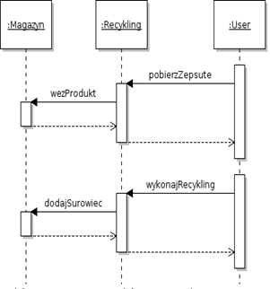

  **Architektura zorientowana na usługi**
  ----------------------------------------- -------- --------------------------------- -----------------
  2

**Projekt usługi magazynu dla systemu fabryki**

**Diagramy klas:**

Powyższy diagram prezentuje propozycję naszego zespołu dotyczącą modelu
klas. Wszystkie przypadki użycia są zdefiniowane w metodach interfejsu
**Magazyn**. Wszystkie dodane formy lądują w bazie danych za
pośrednictwem klasy implementującej **FormaRepository**, natomiast każdy
umieszczony projekt trafia do bazy danch, do której dostęp osiągamy
dzięki klasie implementującej interfejs **ProjektRepository**. Oba
repozytoria posiadają metody ułatwiające odnajdywanie konkretnego
obiektu. Umieszczany projekt identyfikowany jest jedynie za pomocą id i
stanu, w związku z czym obiekt z resztą atrybutów należy skorzystać z
klasy **ProjektFactoryImpl**, która jest implementacją wzorca fabryki i
potrafi zbudować obiekt na podstawie podanych informacji (id i stanu).
Na potrzeby projektu trzeba również zdefiniować parę typów
enumeratywnych. Najważniejszym z nich jest **Stan**, który określa na
jakim etapie obróbki jest produkt (obiekt klasy **Projekt**), stan może
byc zmieniony poprzez inne usługi które obrabiają (stany: pomalowany,
oszlifowany, do kontroli) bądź oceniają produkt (stany: zepsuty,
gotowy). Do projektu należy jeszcze zdefiniować dostępne kolory jako, że
można go pomalowac, do formy natomiast należy zdefiniowac jakieś
kształty. Ich definicją powinnien zająć się zespół odpowiedzialny za
usługę produkcji. Na diagramach przedstawione zostały propozycje.

**Diagramy sekwencji:**

Poniżej przedstawione zostały diagramy sekwencji, które opisują
interakcję pomiędzy usługą magazynu, a pozostałymi usługami. User to
dowolna usługa wywołująca metodę innej usługi.

 

