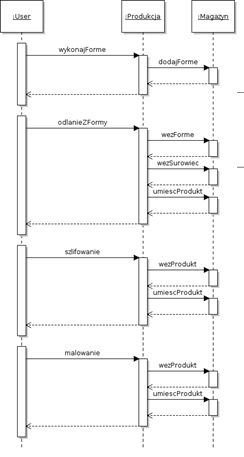

Autorzy:

Mariusz Marzec

Rafa³ Leœniak

# Specyfikacja Produkcji

## 1. Wstêp

 Us³uga produkcji zajmuje siê tworzeniem i obrabianiem kolejnych elementów wymaganych do stworzenia samochodu.

 Projekt samochodu (Produkt) sk³ada siê z 4 czêœci, które równie¿ s¹ osobnymi projektami, identyfikowanymi osobnymi ID\_Projektu:

\* Ko³a

\* Pilot

\* Obudowa

\* Silnik

 Us³uga produkcji przyjmuje konkretne ID\_Projektu do stworzenia potrzebnego elementu na linii produkcyjnej. Nastêpnie sprawdzany jest stan zasobów w magazynie, które s¹ konieczne do wykonania po¿¹danego elementu. Jeœli iloœæ zasobów wystarcza do wykonania go, s¹ one pobierane z magazynu, nastêpnie podejmowane s¹ dzia³ania w wyniku których zwracany do magazynu jest element, którego ¿¹dano.

## 2. Us³ugi

| Operacja | Wejœcie | **Wyjœcie** | Wyj¹tki |
| --- | --- | --- | --- |
| wykonajForme | ID\_Projektu | ID\_Formy | Brak materia³u na formê |
| wykonajOdlew | ID\_Projektu | - | Brak materia³u na odlew |
| szlifuj | ID\_Projektu | - | Brak czêœci do szlifowania |
| Maluj | ID\_Projektu | - | Brak czêœci do malowania |
| dodajZamowienia | iloscZamowien | - |

## 3. Powi¹zanie z innymi us³ugami

 Us³uga produkcji jest mocno powi¹zana z us³ugami magazynu, poniewa¿ na ka¿dym kroku produkcji z magazynu pobierane s¹ zasoby potrzebne do stworzenia po¿¹danego elementu, a nastêpnie trafia on z powrotem do magazynu.

## 4. Diagram sekwencji

Diagram przedstawia wszystkie us³ugi jakie s¹ konieczne do wykonania aby wykonaæ jeden element.

## 5. Przypadki u¿ycia

### 5.1 Wykonanie formy

Aktor: Klient

Skrót: U¿ytkownik wybiera projekt dla którego chce wykonaæ formê. Jest ona tworzona i trafia do magazynu.

1. 1.System udostêpnia us³ugê do tworzenia form dla konkretnego ID\_Projektu.
2. 2.U¿ytkownik wo³a us³ugê podaj¹c ID\_Projektu.
3. 3.Z magazynu pobierany jest materia³.
4. 4.W procesie produkcji tworzona jest forma.
5. 5.Utworzona forma zostaje przeniesiona do magazynu.
6. 6.U¿ytkownikowi zwracane jest ID\_Formy.

### 5.2 Wykonanie odlewu

Aktor: Klient

Skrót: U¿ytkownik wybiera projekt dla którego chce wykonaæ odlew. Jest on tworzony i trafia do magazynu.

1. 1.System udostêpnia us³ugê do tworzenia odlewu dla konkretnego ID\_Projektu.
2. 2.U¿ytkownik wo³a us³ugê podaj¹c ID\_Projektu.
3. 3.Z magazynu pobierany jest materia³ oraz utworzona forma.
4. 4.W procesie produkcji tworzony jest odlew.
5. 5.Utworzony odlew zostaje przeniesiony do magazynu.

### 5.3 Szlifowanie

Aktor: Klient

Skrót: U¿ytkownik wybiera czêœæ któr¹ chce oszlifowaæ, podaj¹c ID\_Projektu jej odpowiadaj¹cego

1. 1.System udostêpnia us³ugê do szlifowania czêœci dla konkretnego ID\_Projektu.
2. 2.U¿ytkownik wo³a us³ugê podaj¹c ID\_Projektu.
3. 3.Z magazynu pobierana jest dana czêœæ
4. 4.Nastêpuje szlifowanie czêœci
5. 5.Oszlifowana czêœæ zostaje przeniesiona do magazynu

### 5.4 Malowanie

Aktor: Klient

Skrót: U¿ytkownik wybiera czêœæ któr¹ chce pomalowaæ, podaj¹c ID\_Projektu jej odpowiadaj¹cego

1. 1.System udostêpnia us³ugê do malowania czêœci dla konkretnego ID\_Projektu.
2. 2.U¿ytkownik wo³a us³ugê podaj¹c ID\_Projektu.
3. 3.Z magazynu pobierana jest dana czêœæ
4. 4.Nastêpuje malowanie czêœci
5. 5.Pomalowana czêœæ zostaje przeniesiona do magazynu

### 5.5 Dodawanie zamówie¿

Aktor: Klient

Skrót: U¿ytkownik wybiera ilo¿¿ zamówie¿, które chce doda¿ do wyprodukowania

1. 1.System udost¿pnia us¿ug¿ dodawania ilo¿ci zamówie¿ do wyprodukowania.
2. 2.U¿ytownik wo¿a us¿ug¿ podaj¿c ilo¿¿ zamówie¿ do wyprodukowania.
3. 3.Nast¿puje dodanie nowych zamówie¿ do licznika zamówie¿.
