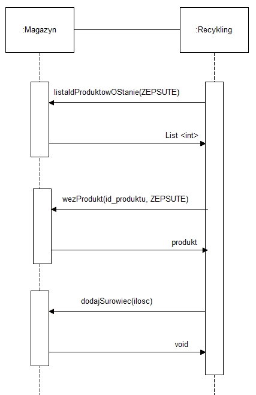

# **Recykling**
---
## Osoby odpowiedzialne

_Łukasz Gawor_

_Michał Ernst_

---
## Usługi dostarczane przez komponent

| Operacja | Wejście | Wyjście | Wyjątek| 
| ------------ | :---: | :---: | :---: |
| handleWithRecycling | N/A | void | N/A |

### Opis

* **handleWithRecycling** - usługa odpowiedzialna za sterowanie wszystkimi czynnościami związanymi z procesem recyklingu. Do jej zadań należy odpytywanie komponentu Magazynu, czy posiada na stanie obiekty przeznaczone do przetworzenia. Dalej pobranie tych obiektów, przetworzenie ich i zwrócenie na stan Magazynu surowca jaki powstał w wyniku recyklingu. W tym celu wykorzystuje ona niektóre z usług jakie udostępnia komponent Magazynu (patrz dalsza część dokumentacji). Serwis usługi ma być wywoływany cyklicznie z zewnątrz aplikacji - crontab czy podobny scheduler - z tego powodu serwis nie przyjmuje żadnych parametrów wywołania ani nie zwraca wartości. Całość sterowania procesami jest zaimplementowana wewnątrz tej usługi.
---
## Wykorzystywane stany obiektów
| int | enum |
| --- | :--- |
| 5 | ZEPSUTY |

Do poprawnej pracy komponentu potrzebujemy wyłącznie jednego enuma/stanu - reszta jest poza obszarem zainteresowania komponentu zajmującego się recyklingiem

---

## Diagram interfejsu
| << interface >>  RecyclingWebApp|
| :---: | 
| + handleWithRecycling(): void |

---

## Diagram Sekwencji
Poniżej został przedstawiony diagram opisujący komunikację z komponentem Magazynu

